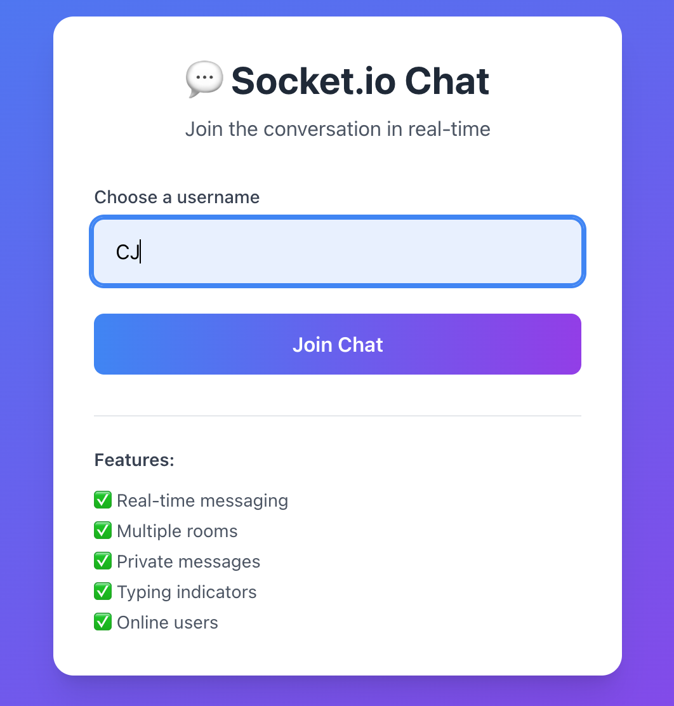
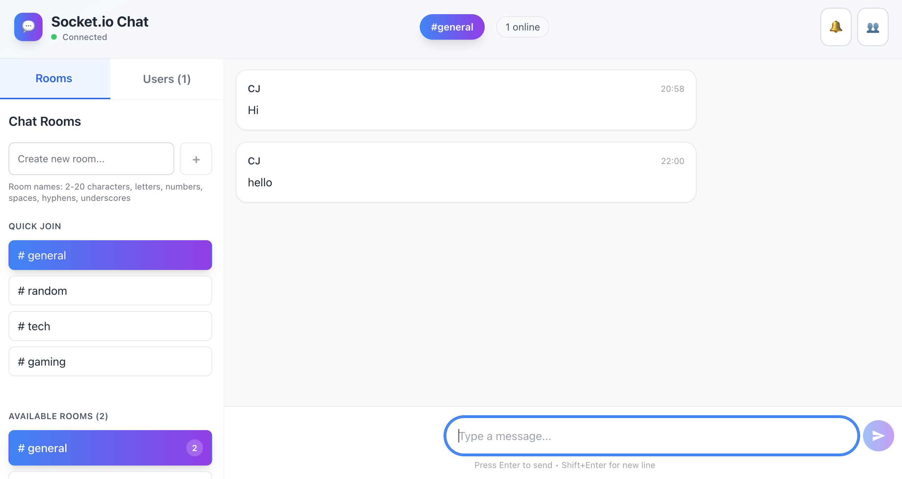
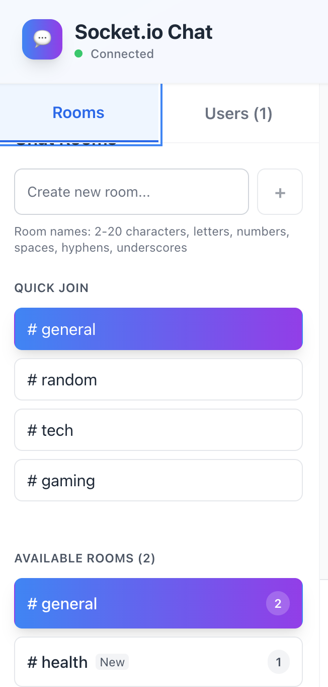
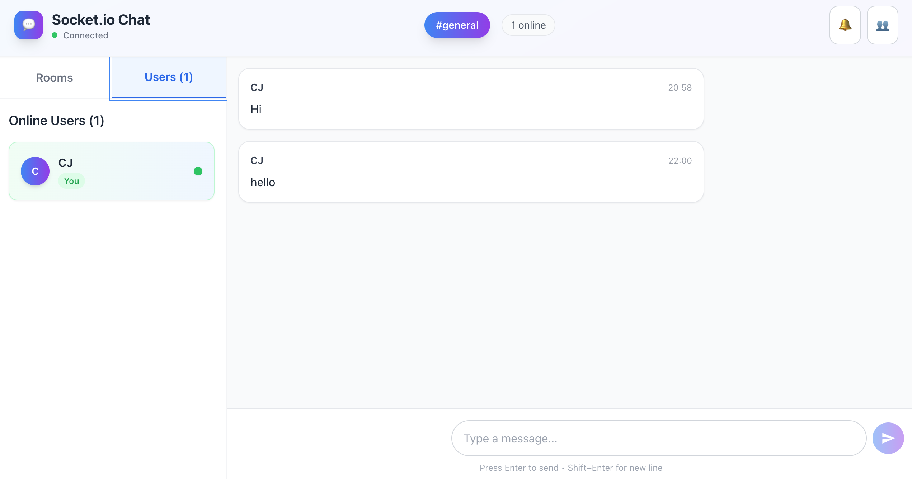

# 💬 Socket.IO Chat App

## 📋 Project Overview
A real-time chat application built with the **Socket.IO** for instant messaging.  
The app supports multiple chat rooms, private messaging.

---

## 🎯 Core Features Implemented
✅ Real-time messaging with instant delivery  
✅ Multiple chat rooms with room switching  
✅ Private messaging between users  
✅ User presence - see who's online  
✅ Typing indicators - see when others are typing 
✅ User notifications for new messages  
✅ Responsive design for all devices  

---

## 🛠️ Technical Implementation

### 🖥️ Frontend (React)
- **Custom Socket Hook (`useSocket.js`)** - Manages all real-time communication  
- **State Management** - Handles messages, users, rooms, and connection status  
- **Event Handling** - Comprehensive socket event listeners for all features  

### ⚙️ Backend (Node.js + Express + Socket.IO)
- **WebSocket Server** - Handles real-time bidirectional communication  
- **REST API** - Room management  

---

## ✅ Key Achievements 
- Stable socket connections with auto-reconnection  
- Complete room management (create, join, switch rooms)  
- Real-time features: typing indicators, user join/leave notifications  
- Production-ready error handling and connection management  

---

## 🚀 Getting Started

### Requirements
- Node.js v14+  
- MongoDB (local or Atlas)  
- Ports: 5173 (frontend), 5000 (backend)

---

## ⚡ Setup Instructions

### 1️⃣ Server Setup
```bash
cd server
npm install
npm run dev
```

### 2️⃣ Client Setup
```bash
cd client
npm install
npm run dev
```

### 3️⃣ Environment Variables
Create `.env` files in both **server** and **client** directories with the provided configurations.

---

## 🎯 Features Implemented

### ✅ Core Features
- Real-time messaging with Socket.IO  
- User authentication (username-based)  
- Multiple chat rooms  
- Online/offline status  
- Typing indicators  
- Message timestamps  

### 🚀 Advanced Features
- Private Messaging - Secure 1:1 conversations  
- Multiple Chat Rooms - Create and join different rooms  
- Real-time Notifications - Browser and in-app notifications  
- Typing Indicators - See when users are typing    
- User Presence - Real-time online/offline status  
- Auto-reconnection - Handle connection drops  
- Responsive Design - Mobile-friendly interface  

### ⚙️ Performance Optimizations  
- Reconnection logic  
- Efficient state management  
- Optimized Socket.IO configuration  
- Memory management  

---

## 🖼️ App Screenshots

| Screenshot | Description |
|-------------|--------------|
|  | **User Login Page** |
|  | **Main Chat Interface** |
|  | **Chat Rooms List** |
|  | **Online Users Panel** |


---

## 📊 Status: COMPLETE & FUNCTIONAL
The application is fully implemented with all planned features working as expected. To add persistant messages with MongoDB integration.

